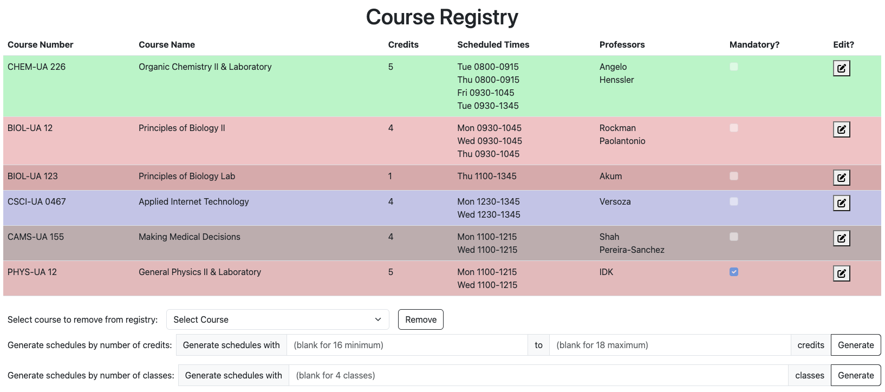
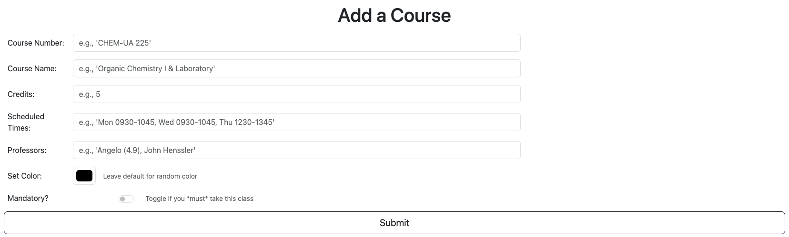
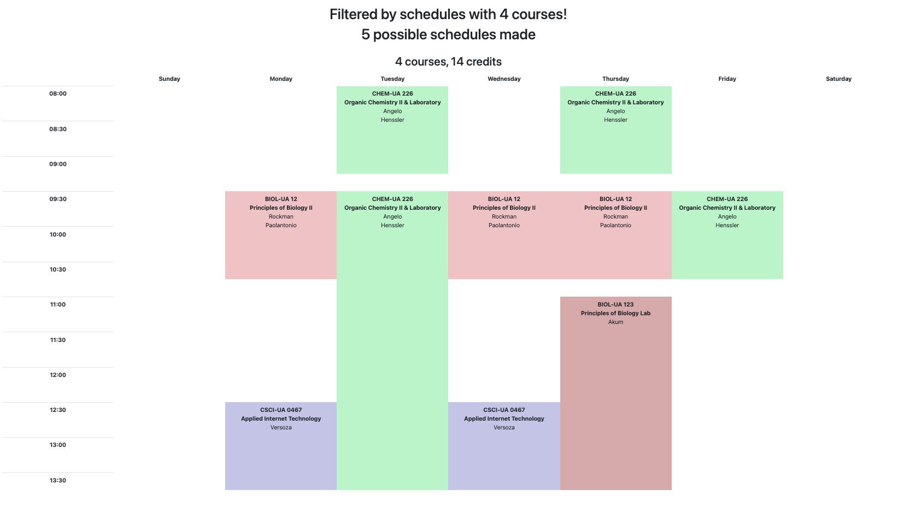

# Course Schedule Designer

## Overview

Keeping track of the myriad of courses you want to take, their offered times, and the ratings of professors can be a massive hassle. If you're like me, this involves spreadsheets, lists, and hours of frustration.

The goal of this web app is to track what classes you have an interest in, and offer a set of schedules based on the selected coureses. 

Users can register and login. Once logged in, the courses they have chosen will be displayed, with the options to add and remove courses, assign priority (I.E., if you must take a course, flag it as so), and generate potential schedules.

## Data Model

The application will store Users, Courses, scheduled times, and Professors

* users can have many courses (via reference)
* courses can have multiple time blocks (by embedding)
* courses can have multiple proessors (by embedding)

An Example User:

```javascript
{
  username: "michael",
  hash: // a password hash,
  courses: // an array of references to Course documents
}
```

An Example Course with Embedded Items:

```javascript
{
    courseNumber: "CSCI-UA 0467",
    courseName: "Applied Internet Technology",
    credits: 4,
    scheduledTimes: [
        {day: "Monday", start: "0930", end: "1045"},
        {day: "Wednesday", start: "0930", end: "1045"}
    ],
    Professors: [
        {first: "Joe", last: "Versoza", rating: 3.5}
    ],
    mandatory: true, // Thank you to the grader who recommended I include this in my schema
    color: #FFFFFF,
}
```

## [Link to Schema](models/course.mjs) 

## Wireframes

/courses - page for showing the courses in registry



/courses/add - page for creating a new shopping list



/courses/schedules - page for viewing schedules based on registry



## Site Map


## User Stories or Use Cases

1. as non-registered user, I can register a new account with the site
2. as a user, I can log in to the site
3. as a user, I can view currently added courses
4. as a user, I can add courses to the registry
5. as a user, I can remove courses from the registry
6. as a user, I can assign priority to courses
7. as a user, I can generate potential schedules based on selected courses
8. as a user, I can export generated schedules

## Research Topics

* (5 points) Integrate user authentication
    * I'm going to be using passport for user authentication
* (3 points) Perform client side form validation using a JavaScript library
    * If you put in a number that's in an invalid format (such as bad time slot format, bad course name format), a message will appear in the DOM
    * Also involves learning REGEX for ensuring data follows the predetermined patterns
* (2 point) Use Bootstrap as a CSS Framework
    * Will configure a theme using Bootstrap to make the website hurt the user's brain a little bit less
* (5 points) NYU Course System API
    * This one is a long shot for if I happen to get the rest of the project done
    * Addition of this feature would support adding courses to registry via the NYU Course ID, and the necessary data fields would be pulled from the NYU Course System API

15 points total out of 10 required points

## [Link to Initial Main Project File](app.mjs) 

## Annotations / References Used

1. [Bootstrap documentation: my best friend](https://getbootstrap.com/docs/5.3/getting-started/introduction/) - [layout.hbs](views/layout.hbs), [course-list.hbs](views/course-list.hbs), [add-course.hbs](views/add-course.hbs),  [schedules.hbs](views/schedules.hbs) 
2. [Bouncer.js for client-side form validation](https://github.com/cferdinandi/bouncer) - [layout.hbs](views/layout.hbs), [add-course.hbs](views/add-course.hbs)
3. [Font Awesome Icons](https://fontawesome.com/) - [layout.hbs](views/layout.hbs), [course-list.hbs](views/course-list.hbs)
4. [Passport.js Tutorial](https://heynode.com/tutorial/authenticate-users-node-expressjs-and-passportjs/) - [app.mjs](app.mjs), [course.mjs](models/course.mjs)

